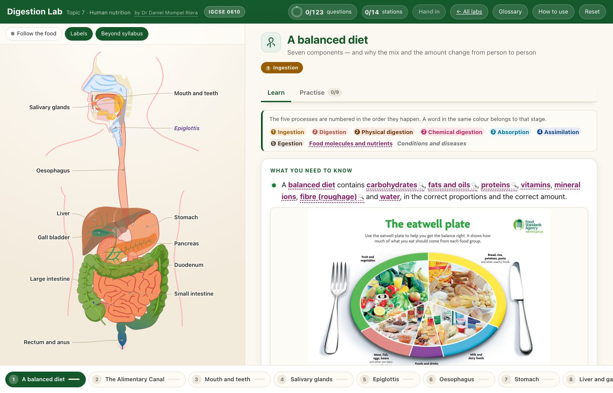

<h1>🍽️ &nbsp;Digestion Lab</h1>

**Cambridge IGCSE Biology 0610 · Topic 7 — Human nutrition**

by **Dr Daniel Mompel Riera** · NLCS Jeju

---

## What a student does

Click any organ on the canal and work through that station: what the exam wants, what it
actually looks like, and questions that say right or wrong — never the answer. Or send a meal
down the whole canal and stop at each organ in turn.

|  |  |
|---|---|
| 🫃 **14 stations** | diet · the canal · mouth and teeth · salivary glands · epiglottis · oesophagus · stomach · liver and gall bladder · pancreas · small intestine · large intestine · rectum and anus · molecules and enzymes · the practicals |
| ✍️ **123 questions** | fill the gaps · drag & drop · multiple choice · put in order · match up · sort into groups · set the pH |
| 🔬 **Real pictures** | dissections, micrographs and photographs, not diagrams of diagrams |
| 🧪 **A practical you run** | the visking tubing experiment — nothing happens unless you act |
| 📖 **A shared glossary** | one wording per term, the same in every lab |

> [!NOTE]
> **The answers are not in the page.** Each question ships a salted hash of its answer, so the
> lab can say *wrong* but nothing in the download can say what *right* is. There is no mode
> that reveals them, because there is nothing to reveal.

## Where it sits

One of the labs behind the [Human Body Hub](https://mompel226.github.io/human-body-hub/), which
is one shelf of the [Biology Hub](https://mompel226.github.io/biology-hub/) — the front door to
every Biology app here. The **← All labs** button goes back up.

> [!TIP]
> **Want your students' scores in a spreadsheet of your own?**
> Set it up once, for every lab at the same time:
> **[Would you like to see how your students are doing?](https://github.com/Mompel226/biology-hub#-would-you-like-to-see-how-your-students-are-doing)**

<b>Behind the scenes</b> — how this lab is put together

 

The plate is an SVG with a camera that flies the view between organs; each station has its own
short animation. The visking-tubing practical is a real simulation — the tubing, the water bath
and the tests respond to what you do, and nothing happens on its own.

Every question ships a **salted hash** of its answer, made at build time. The lab hashes what
the student did and compares. That is why it can say *wrong* without anything in the download
knowing what *right* is.

The activity engine, the marking and the glossary are shared with every other lab and copied in
when the lab is built, so a fix reaches all of them. The content — 14 stations, 123 questions
and the photographs — is this lab's own.

**Build it:** `node tools/build.mjs`. It stamps `version.txt` and every `?v=` together (the
stamps are the real cache key), and it refuses to finish unless every answer still marks
correctly. `js/engine.js`, `js/marking.js`, `js/data/*` and `sw.js` are generated — edit
`labs-shared/`, not the copies.

**Forking:** everything the page loads is in this repository, so a fork runs as-is. You cannot
rebuild the questions — `tools/build.mjs` needs `../digestion-lab-source/stations.master.js`,
which is never published. That is the same fact that keeps the answers from students. If you
only want to *use* the lab, send the link; there is nothing to fork.

Photograph credits: [`assets/photos/CREDITS.md`](assets/photos/CREDITS.md).

Made by **Dr Daniel Mompel Riera** · Biology, NLCS Jeju ·
[dmompelriera@nlcsjeju.kr](mailto:dmompelriera@nlcsjeju.kr)
